# Howdy, I'm Wags.

I make things on the Internet for fun, and break stuff sometimes. It's super entertaining! Most of what I build lives in the overlap between **emergency alerting**, **speech synthesis**, and **dragging old tech back from the dead before it disappears for good**.

If you came for puzzles instead, I host those (and training for them) over at [wagspuzzle.space](https://wagspuzzle.space/).

---

## 📡 Emergency Alerting + Weather Radio

The bulk of my public work: encoding, decoding, and understanding EAS / SAME and NOAA Weather Radio.

- **[EAS-Tools](https://github.com/wagwan-piffting-blud/EAS-Tools)** -- a fully browser-based ENDEC. Encode and decode SAME right in the page, no install. My most-used project.
- **[EAS_Listener](https://github.com/wagwan-piffting-blud/EAS_Listener)** -- a Rust-native software ENDEC with CAP support.
- **[E2T-NG](https://github.com/wagwan-piffting-blud/E2T-NG)** -- EAS2Text, Next Generation. Turns a raw SAME header into plain English, using multiple programming languages.
- **[EMNet_Mocker](https://github.com/wagwan-piffting-blud/EMNet_Mocker)** -- mock EAS alerts built from EMNet voice files.

## 🗣️ Speech Synthesis + Voice Preservation

Recovering discontinued TTS voices and wiring them into things that talk.

- **[Speechify_EAS_Listener](https://github.com/wagwan-piffting-blud/Speechify_EAS_Listener)** -- a Speechify TTS backend for EAS_Listener's CAP pipeline, written in C.
- **[AcuVoice-Roger](https://github.com/wagwan-piffting-blud/AcuVoice-Roger)** -- the desktop "Roger" voice, rescued and repackaged for SAPI5 (see also the archived [Fonix-Roger](https://github.com/wagwan-piffting-blud/Fonix-Roger) for the lineage).
- **[FestvoxKalMonotone](https://github.com/wagwan-piffting-blud/FestvoxKalMonotone)** -- mild poking at the Festival Speech Synthesis System.

## 🎮 Game Preservation

- **The Beat Revival** -- keeping *Mirror's Edge: Catalyst* (2016) alive. More at [beatrevival.me](https://www.beatrevival.me/).

## 🧩 Puzzles, ARGs + the Rest

- The Mr. Robot ARGs (all of season 3, some of 4).
- **[project-skydrop](https://github.com/wagwan-piffting-blud/project-skydrop)** -- code snippets from the Project Skydrop treasure hunt.

...always with more to come.

---

## Tooling I usually reach for

`Rust` · `Python` · `C` · `C++` · `JavaScript/HTML/CSS`

...and whatever a given project drags me into (Scheme, C#, Kotlin, plain bash, you name it).

---

## 📊 The numbers

  
  

---

## 📫 Find me

- Site + contact form: **[wagspuzzle.space](https://wagspuzzle.space/)**
- Bluesky: [@wagspuzzle.space](https://bsky.app/profile/wagspuzzle.space)
- Keybase: [wags2piffting](https://keybase.io/wags2piffting/)
- Plain email: `contact` ['ae t] `wagspuzzle` [d aa t] `space`

I check my emails and GitHub issues multiple times a day and am always eager to chat, though responses may be delayed depending on how busy I am at any given moment. Thanks!
